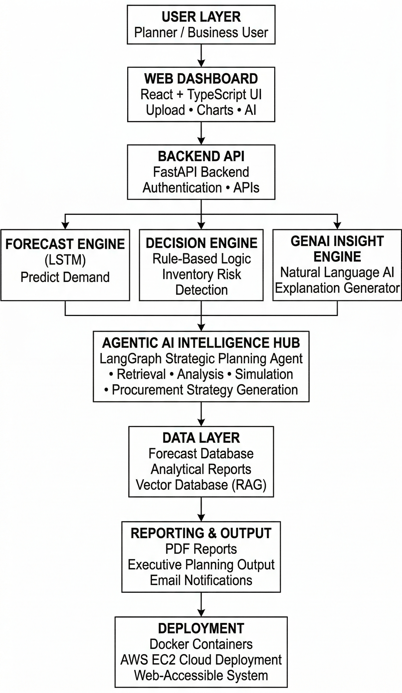

# 🌾 NIYOJAN: The Agentic AI Supply Chain Intelligence Platform

**Niyojan** is an enterprise-grade, AI-driven demand forecasting platform that bridges the gap between raw supply chain data and strategic executive action. 

By unifying **LSTM Time-Series Forecasting** with **LangGraph-driven LLMs (Google Gemini)**, Niyojan doesn't just predict future demand—it acts as an autonomous supply chain analyst that diagnoses risks, runs simulations, and drafts actionable procurement plans to optimize stock levels and prevent inventory crises.

---

## 🏛️ System Architecture



Niyojan operates on a robust, multi-tier architecture built for deterministic machine learning inference and complex generational AI workflows:

### 1. Presentation Layer (React + Vite)
- **Interactive Operational Dashboard**: A purpose-built UI for ingesting CSV batch data and visualizing 12-week demand horizons using `Recharts`.
- **Agentic Chat Hub**: A real-time terminal where users interact naturally with the LangGraph backend to query forecasts or run data-driven "what-if" simulations.

### 2. Logic & Inference Layer (FastAPI)
- **Deterministic Inference Engine**: A globally trained TensorFlow/Keras LSTM model dynamically processes incoming multi-variate sequences, generating forward-looking horizons.
- **Rule-Based Post-Processing**: The system calculates standard deviations, Z-scores, and inventory gaps to deterministically assign risk profiles (High/Medium/Safe).

### 3. Agentic Intelligence Pipeline (LangGraph & RAG)
- **Intent Routing Node**: Zero-shot LLM classification dynamically routes user queries into four distinct conversational tracks: `Retrieval (RAG)`, `Analysis`, `Simulation`, or `Strategic Planning`.
- **Retrieval-Augmented Generation**: Integrates FAISS and text embeddings to cross-reference user queries against uploaded operational guidelines (PDFs).
- **Execution Nodes**: Constrains natural language generation into strict, actionable JSON schemas, outputting 4-week executive plans directly into the UI state.

---

##  Key Features & Capabilities

### 1. Intelligent Time-Series Forecasting
*   **Deep Learning Models**: Uses **LSTM (Long Short-Term Memory)** networks to auto-regressively predict sales demand for up to 12 weeks into the future.
*   **Automated Trend Detection**: Identifies and tags complex mathematical relationships, rendering upward (↗), downward (↘), or stable (→) demand signals.

### 2. LangGraph Agentic Insight Engine
*   **Powered by Google Gemini 1.5**: Transcends raw numbers by generating qualitative business insights.
*   **Dynamic Scenario Simulation**: Autonomously recalculates Reorder Points (ROP) and safety stocks on the fly based on conversational "what-if" prompts (e.g., *"What happens if demand spikes by 20% next month?"*).
*   **Actionable Directives**: Suggests **Restock**, **Hold**, or **Reduce** decisions based on predicted demand vs. current inventory, calculating exact deficit quantities.

### 3. Comprehensive Operational Dashboard
*   **Unified Visualization**: Dynamic UI components displaying category-wise demand, product trends, and revenue projections.
*   **Real-time Alerts**: Automatic backend cron jobs or active listeners flag critical stock levels.
*   **Automated Intelligence Delivery**: Headless PDF generation using `ReportLab` triggered by backend events, seamlessly distributed via robust SMTP protocols to organizational leaders.

---

##  Repository Structure & Code Organization

```text
niyojan/
│
├── backend/
│   ├── app/
│   │   ├── main.py          # FastAPI application entrypoint
│   │   ├── core/            # System configurations & middleware
│   │   ├── agents/          # LangGraph Nodes, State, & RAG engines
│   │   ├── routes/          # API endpoint controllers (intelligence.py, etc.)
│   │   └── services/        # Business logic & utilities
│   ├── reports/             # Dynamically generated PDF report artifacts
│   └── tests/               # Backend unit and integration tests
│
├── frontend/                # React + Vite Application
│   ├── src/
│   │   ├── components/      # Reusable UI charts and interactive elements
│   │   ├── pages/           # Views (Dashboard.tsx, AgenticHub.tsx)
│   │   └── api.ts           # Centralized HTTP request interceptors
│   └── package.json
│
├── database/
│   ├── niyojan.db           # Configurable SQLite schema footprint
│   ├── db_manager.py        # Optimized bulk-insert database controllers
│   └── schema.sql           # Core tables (users, forecasts, alerts)
│
├── genai/                   # Auxiliary GenAI & LLM Services
│   ├── insight_engine.py    # Prompts for single-product deep dives
│   └── llm_client.py        # Gemini Client wrappers
│
├── lstm/                    # Predictive ML Pipelines
│   ├── global_lstm_model/   # Trained TensorFlow LSTM artifacts (.pb)
│   └── notebook.ipynb       # Jupyter workflow for model validation
│
├── utils/
│   ├── email_handler.py     # Asynchronous SMTP Email utility
│   ├── decision_engine.py   # Deterministic alert trigger logics
│   └── pdf_report_generator.py # ReportLab diagram rendering & generation
│
├── .env                     # Local Environment secrets (ignored)
├── pyproject.toml           # Poetry dependency environments
└── README.md                # System Documentation (You are here)
```

---

##  Technology Stack

| Component | Framework / Library |
|-----------|----------------------|
| **Frontend UI** | React 18, Vite, TypeScript, Tailwind CSS, Recharts |
| **Backend API** | Python 3.10+, FastAPI, Pydantic, Uvicorn |
| **Machine Learning** | TensorFlow, Keras, Scikit-learn, Pandas, NumPy |
| **Agentic AI** | LangGraph, LangChain, Google Gemini API, FAISS |
| **Storage & Tracking** | SQLite3 (Adaptable via SQLAlchemy) |
| **Automation** | ReportLab (PDFs), Native Python `smtplib` |

---

##  Configuration (.env)

Create a `.env` file in the **project root** containing your API configurations:

```ini
# --- Authentication & Security ---
JWT_SECRET=your_super_secret_jwt_key
JWT_EXPIRE_MINUTES=720

# --- GenAI (Google Gemini) Orchestration ---
GOOGLE_API_KEY=your_google_gemini_api_key
GEMINI_API_KEY=your_google_gemini_api_key

# --- Email Automation (Gmail App Password) ---
SMTP_SERVER=smtp.gmail.com
SMTP_PORT=587
SMTP_EMAIL=your_email@gmail.com
SMTP_PASSWORD=your_gmail_app_password
```
*(Note: Use Google App Passwords if 2FA is enabled on the sending account).*

---

##  Installation & Local Setup

### 1. Clone the repository
```bash
git clone https://github.com/Satya-Mohapatro/NIYOJAN-The-Intelligent-Bridge-Between-Supply-Demand.git
cd NIYOJAN-The-Intelligent-Bridge-Between-Supply-Demand
```

### 2. Backend Initialization
We highly recommend using **Poetry** for deterministic dependency resolution.

**Option A (Poetry):**
```bash
poetry install
poetry shell
```

**Option B (Pip/Venv):**
```bash
# Create virtual environment
python -m venv venv

# Activate (Windows)
venv\Scripts\activate
# Activate (Mac/Linux)
source venv/bin/activate

# Install dependencies
pip install -r backend/requirements.txt
```

### 3. Frontend Initialization
```bash
cd frontend
npm install
```

---

## 🚀 Running the Platform

### Step 1: Initialize the Database Pipeline
Ensure the fundamental tables are constructed.
```bash
cd database
python create_db.py
cd ..
```
*Creates the foundational admin credentials automatically:* `admin@niyojan.ai` / `admin123`

### Step 2: Boot Backend Microservices
From the project root directory:
```bash
uvicorn backend.app.main:app --reload
```
*API Swagger Documentation is mounted sequentially at:* [http://127.0.0.1:8000/docs](http://127.0.0.1:8000/docs)

### Step 3: Serve the UI Client
Open a new parallel terminal session:
```bash
cd frontend
npm run dev
```
*Access the client safely at:* [http://localhost:5173](http://localhost:5173)

---

##  Operational User Guide

1.  **Authenticate**: Use the local admin credentials (`admin@niyojan.ai` / `admin123`) to enter the system.
2.  **Upload Operations Data**: Navigate to the **Dashboard** and supply a CSV formatted closely to: `Product_ID`, `Product_Name`, `Category`, `Week`, `Sales_Quantity`.
3.  **Execute Inference Run**: Click run. The system invokes the LSTM network to deterministically stretch data horizons and triggers rule-based inventory alerts.
4.  **Agentic Interrogation**: Transition to the **Agentic Hub** to dynamically chat with the data. Upload operations handbooks (PDFs) to align predictions against corporate risk thresholds via RAG protocols.
5.  **Generate Board-Ready Analytics**: Navigate to the **Reports** tab to render the raw UI data into a finalized, emailable PDF summary utilizing the backend headless reporting pipeline.

---

##  System Design Philosophy

This platform was built to demonstrate how autonomous, multi-agent workflows (LangGraph) can augment traditional, deterministic machine learning pipelines (TensorFlow/LSTM). By abstracting the complex mathematical limits of LSTM horizons and probabilistic distributions into actionable, plain-language conversational insights, Niyojan directly answers and tackles the "black box" problem of deploying massive AI arrays in traditional enterprise resource planning.

--- 
**Contributing & Support**: Niyojan is built to scale. PRs focused on replacing backend modules (e.g., swapping SQLite for Postgres/Redis pipelines) or expanding Agentic nodes are welcome. Please reference architectural diagrams before submitting branch merges.
